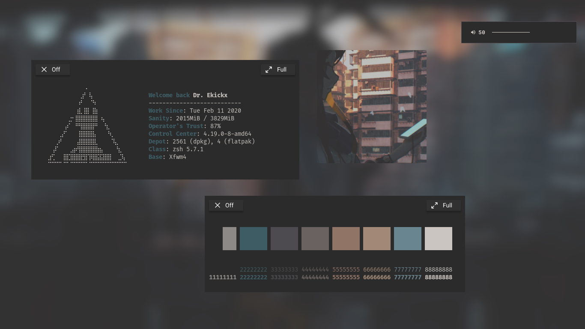

## Table of Content


- [What is this?](#what-is-this)
- [Want to use it?](#want-to-use-it)
- [Preview](#preview)
- [Credit](#credit)

----

# What is this?


I use this repo for managing my theme collection, such as **XFCE**, **Openbox**, **AwesomeWM**, etc. I use this repo, instead of [my Dotfiles repo](https://github.com/ekickx/myDotfiles) for managing theme because I find it easier. I use this repo for my theme only and dotfile for other configuration. Btw, I'm inspired by [reorr's repo](https://github.com/reorr/my-theme-collection).

# Want to use it?


**Clone this repo**

```bash
git clone https://github.com/ekickx/MyThemeCollection.git
cd MyThemeCollection/
```

**Deploy theme**

```bash
./deploy.sh <themename>
```

# Preview

## Amiyaa



# Credit


- [Muktazam Hasbi Ashidiqi](https://github.com/reorr)
- [Harry Kurniawan](https://github.com/owl4ce)
- [Nanda Oktavera](https://github.com/okitavera)
- [Fikri Omar](https://github.com/fikriomar16)
- [Aditya Shakya](https://github.com/adi1090x)
